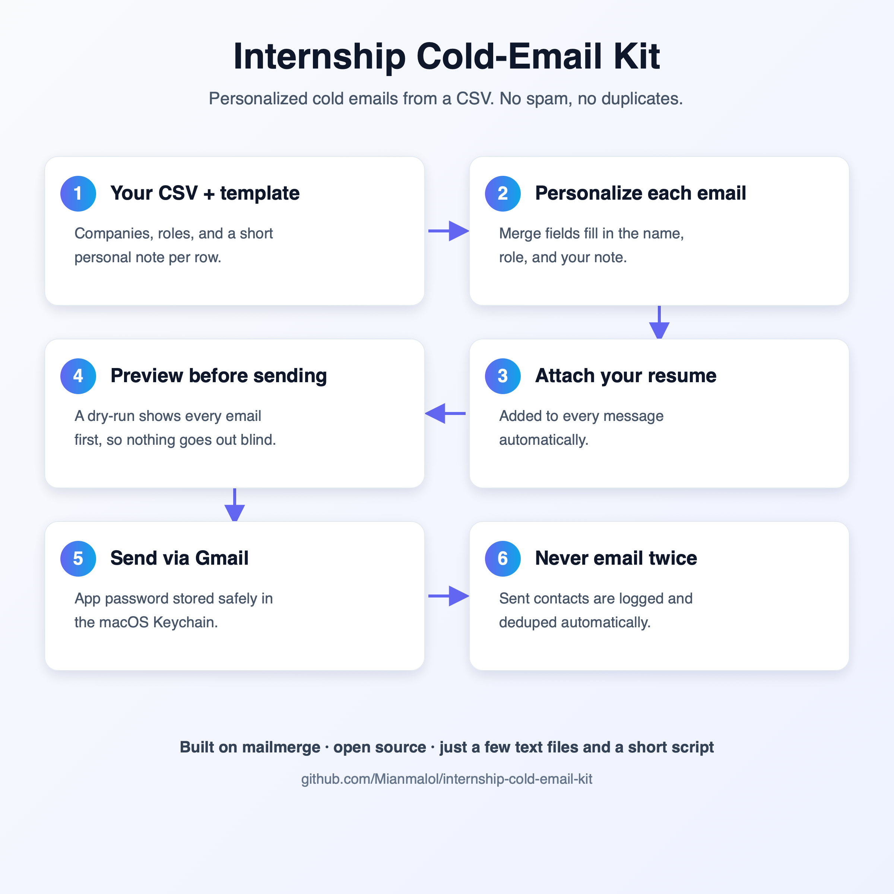

# Internship Cold-Email Kit

A small, transparent **command-line tool** for sending **personalized** internship
(or job) cold emails from your Gmail — with a built-in "never email the same place
twice" safety net, a human approval step before anything goes out, and automatic
follow-up tracking.

You keep a simple spreadsheet (CSV) of who you want to contact and one email
template. The tool fills in the template per recipient, attaches your resume, lets
you preview everything, sends through Gmail, and remembers exactly who you've
contacted and who replied.

> **Is this an app with a UI?** No. It's a **terminal/command-line tool** (you type
> `outreach …` in a shell). There's no window, website, or server. Your data lives in
> plain CSV files on your own machine.

<p align="center">
  
</p>

---

## Contents
- [The Overview](#the-60-second-mental-model)
- [Requirements](#requirements)
- [Install](#install)
- [First-time setup](#first-time-setup)
- [Your daily workflow](#your-daily-workflow)
- [Command reference](#command-reference)
- [The files explained](#the-files-explained)
- [Worked example](#worked-example-from-zero-to-sent)
- [Follow-ups & reply tracking](#follow-ups--reply-tracking)
- [Sending real email — please read](#sending-real-email--please-read)
- [Privacy & your data](#privacy--your-data)
- [Troubleshooting / FAQ](#troubleshooting--faq)
- [For developers](#for-developers)
- [License](#license)

---

## The Overview

Everything is a **funnel made of three CSV files**. A company moves left-to-right and
lives in exactly one place at a time:

```
  outreach_queue.csv  ──stage──▶  mailmerge_database.csv  ──send──▶  sent_log.csv
   (leads you've         (this batch,                  (history: everyone
    researched but        about to go out,              you've emailed, when,
    NOT emailed yet)       previewed first)              and who replied)
```

- **`stage`** moves a chosen number of leads from the queue into the outgoing batch.
- **`preview`** shows you the exact emails. It **never sends.**
- **`outreach-send --send`** is the *only* command that emails. It previews, asks you
  `y/N`, then sends — and immediately records each one in `sent_log.csv`.

Because a sent company lands in `sent_log.csv` and the tool checks that log before
every send, **you can never accidentally email the same place twice.**

You run the whole thing with two commands:
- **`outreach …`** — does everything *up to* a previewed batch (safe to run freely).
- **`outreach-send`** — the single "actually send" door, gated by your approval.

---

## Requirements
- **Python 3.11 or newer** (the tool uses the built-in `tomllib`). Check with
  `python3 --version`.
- A **Gmail account** with a **Gmail App Password** (not your normal password — see
  setup below).
- No other required dependencies. Works on macOS, Linux, and Windows.

---

## Install
```bash
git clone https://github.com/Mianmalol/internship-cold-email-kit.git
cd internship-cold-email-kit

pip install .                 # installs the `outreach` and `outreach-send` commands
```
Optional extras:
```bash
pip install ".[keyring]"      # cross-platform password storage (recommended)
pip install -e ".[dev]"       # for contributors: editable install + pytest + ruff
```

After this, `outreach` and `outreach-send` are available in your terminal.

---

## First-time setup

**1. Create your config and template.**
```bash
outreach setup                # creates config.toml in the current folder
cp mailmerge_template.txt.example mailmerge_template.txt
```
`outreach setup` writes a starter `config.toml`. Open it and fill in your Gmail
address, the path to your resume, and the kind of roles you're targeting:
```toml
[email]
address = "you@gmail.com"

[files]
resume = "resume.pdf"          # put your resume here, matching this name

[pacing]
batch_size = 14                # how many to send per day by default

[outreach]
area = "Machine learning + physics simulation internships, remote, unpaid"
```

**2. Edit your email template** (`mailmerge_template.txt`). Anything in `{{double
braces}}` gets filled in per recipient from your CSV:
```
TO: {{contact_email}}
SUBJECT: {{subject}}
FROM: Your Name <you@gmail.com>
ATTACHMENT: resume.pdf

Hi {{contact_name}},

I'd love to intern at {{company}}. {{note}}.

Best,
Your Name
```

**3. Get a Gmail App Password** (this is *not* your login password):
- Turn on 2-Step Verification: https://myaccount.google.com/security
- Create an App Password: https://myaccount.google.com/apppasswords

**4. Store the password once.** Pick the one that fits your setup (the tool checks
them in this order):
```bash
keyring set mailmerge-gmail "$USER"                              # any OS — recommended
security add-generic-password -s mailmerge-gmail -a "$USER" -w   # macOS Keychain
export OUTREACH_GMAIL_APP_PASSWORD=...                           # quick/CI only (see note)
```
> The env-var option is handy for testing but less safe (it can leak via shell
> history and logs) — prefer `keyring` or the macOS Keychain for everyday use.

**5. Confirm everything's wired up:**
```bash
outreach setup
```
```
config.toml: OK (/path/to/config.toml)
Resume: OK /path/to/resume.pdf
Password: OK via keyring
Sender:  you@gmail.com
Area:    Machine learning + physics simulation internships, remote, unpaid
```

> **Where does it look for config?** In order: a `--config PATH` you pass, the
> `$OUTREACH_CONFIG` environment variable, or `config.toml` in your current folder.
> All file paths in `[files]` are relative to wherever your `config.toml` lives, so you
> can keep each search (or each person) in its own folder.

---

## Your daily workflow

```bash
# 1. See where things stand
outreach status

# 2. Add leads to outreach_queue.csv (research them yourself, or use a finder).
#    Each row: contact_email,contact_name,company,role,subject,note

# 3. Move a batch into the outgoing pile (you choose how many)
outreach stage -n 14

# 4. Read the actual emails before anything is sent
outreach preview

# 5. Send — previews again, asks for confirmation, then delivers
outreach-send --send

# 6. Later: sync replies/dates from Gmail, then see who to follow up with
outreach backfill-dates --apply
outreach followup
```

That's the whole loop. Steps 1–4 are completely safe to run as often as you like;
only step 5 sends mail, and it always asks first.

---

## Command reference

### `outreach` — drive the pipeline (never sends)

| Command | What it does |
|---|---|
| `outreach status` | Funnel snapshot: how many are queued, staged, and already sent. |
| `outreach setup` | Create/verify `config.toml`, resume, password, sender, and area. |
| `outreach find` | Print a "brief" (your target area + the list of companies to exclude) to hand to a lead-finder. |
| `outreach stage -n N` | Move **N** leads from the queue into the outgoing batch. Omit `-n` to use `batch_size` from config. Skips anyone already staged or sent. |
| `outreach preview` | Render the staged emails (subject + recipient). Sends nothing. |
| `outreach replies` | Quick offline check of who has replied (reads Gmail over IMAP). |
| `outreach followup` | List contacts who are past your follow-up window and **haven't replied**. |
| `outreach backfill-dates` | Sync `sent_at` + `last_reply` from Gmail (see [below](#follow-ups--reply-tracking)). Add `--apply` to write. |
| `outreach migrate` | Upgrade an older `sent_log.csv` to the current columns. |

Tip: every command accepts `--config PATH` if your config isn't in the current folder.

### `outreach-send` — the only command that emails

| Command | What it does |
|---|---|
| `outreach-send` | **Dry run** — preview every email, send nothing. |
| `outreach-send --send` | Preview, ask `Send N emails? [y/N]`, then send. |
| `outreach-send --send --yes` | Skip the confirmation (for when you're confident / automating). |

Sending is **crash-safe**: each email is logged to `sent_log.csv` the instant it
succeeds, the outgoing batch shrinks as it goes, and timestamped backups are written
to `.backups/`. If something fails mid-batch, you can just re-run — already-sent
addresses are skipped, so nothing is ever sent twice. Any email that failed to send
stays in the batch for a retry.

---

## The files explained

| File | What it is | Edit it? |
|---|---|---|
| `config.toml` | Your settings: Gmail address, file paths, daily batch size, target area. | Yes (once). |
| `mailmerge_template.txt` | Your email, with `{{placeholders}}`. | Yes. |
| `outreach_queue.csv` | **Backlog** — researched leads you haven't emailed yet. | Yes (add leads here). |
| `mailmerge_database.csv` | **This batch** — what `stage` fills and `send` empties. | Usually let the tool manage it. |
| `sent_log.csv` | **History** — everyone you've emailed, the date, and any reply. | No (the tool owns it). |
| `resume.pdf` | Attached to every email (name it to match `[files].resume`). | — |
| `.backups/` | Automatic timestamped backups before any change to your CSVs. | No. |

### CSV columns
Each lead is one row. The header names map to the `{{placeholders}}` in your template:

| column | used for |
|---|---|
| `contact_email` | the `TO:` address (**required**) |
| `contact_name` | the greeting |
| `company` | `{{company}}` |
| `role` | `{{role}}` |
| `subject` | the email subject line |
| `note` | one sentence personalized to that company |

You can add or rename columns freely — just keep your template's `{{placeholders}}` in
sync with the column names.

---

## Worked example: from zero to sent

```bash
# Put two leads in the queue (normally you'd research these):
cat >> outreach_queue.csv <<'EOF'
founders@acme.dev,Alex,Acme Robotics,Sim Intern,Robotics sim internship,"I saw your work on physics-informed simulation and would love to contribute"
careers@novalabs.io,Sam,Nova Labs,ML Intern,Remote ML internship,"Your scientific computing stack is exactly where I want to grow"
EOF

outreach status            # Queue: 2
outreach stage -n 2        # moves both into the batch
outreach status            # Staged: 2, Queue: 0
outreach preview           # shows both emails, sends nothing
outreach-send --send       # preview → "Send 2 emails? [y/N]" → y → delivered + logged
```

After sending, those two move into `sent_log.csv` and won't be contacted again.

---

## Follow-ups & reply tracking

The tool can read your Gmail to figure out **when** you emailed each company and
**whether they replied**, so follow-ups are automatic and accurate:

```bash
outreach backfill-dates          # dry run: shows what it found, writes nothing
outreach backfill-dates --apply  # writes sent_at + last_reply into sent_log.csv
outreach followup                # who's silent past your window AND hasn't replied
```

What `backfill-dates` does, in two passes over your Gmail:
1. **Send dates** — reads your **Sent** folder to record exactly when each contact was
   emailed (`sent_at`).
2. **Replies** — records who wrote back (`last_reply`). It catches replies sent from
   the same address **and** replies from a *different* address, by following the email
   thread (the `In-Reply-To`/`References` headers). Anyone with a reply is then
   automatically excluded from `followup`.

It's safe to re-run anytime (it backs up `sent_log.csv` first and never overwrites a
newer reply with an older one). No external CRM or service is needed — your Gmail is
the source of truth.

> The Gmail connector in tools like Claude remains the most thorough reply detector
> for unusual edge cases; this built-in check covers the common ones automatically.

---

## Sending real email — please read

This sends real email from **your own** Gmail account, and your account's reputation
is on the line. Use it responsibly:

- **Personalized outreach only — not bulk spam.** Make every `note` genuinely specific.
- **Keep the volume low.** The default is ~14/day (`[pacing].batch_size`). Blasting
  many near-identical cold emails at once is the main thing that trips spam filters and
  can get your account limited. Gmail also enforces daily sending limits.
- **Only email addresses meant to receive applications** (`careers@`, `hiring@`, or
  someone who invited contact). Honor any request to stop, and don't re-contact someone
  who has declined.
- **You are responsible** for complying with anti-spam laws (e.g. CAN-SPAM, GDPR) where
  you live.

---

## Privacy & your data

Everything stays **on your machine**. Your CSVs contain real people's contact details,
so the included `.gitignore` keeps private files out of git: your resume, real contacts
(`mailmerge_database.csv`, `outreach_queue.csv`), `sent_log.csv`, your filled-in
`mailmerge_template.txt`, `config.toml`, and `.backups/`. Only the `.example` files are
meant to be committed.

Never commit your app password — it belongs in a credential store (keyring/Keychain),
not in any file. See [SECURITY.md](SECURITY.md) for details and
[CONTRIBUTING.md](CONTRIBUTING.md) if you'd like to help.

---

## Troubleshooting / FAQ

**"No Gmail app password found."** You haven't stored one yet, or it's under a
different name. Re-run one of the `keyring set …` / `security add-generic-password …`
commands from setup, then `outreach setup` to confirm.

**"Template not found" / "missing header(s)."** Your `config.toml`'s `[files].template`
path is wrong, or the template is missing a `TO:` / `SUBJECT:` line at the top.

**Nothing happens / "No targets… Nothing to send."** Your batch
(`mailmerge_database.csv`) is empty — run `outreach stage -n N` first.

**Can I run several searches separately?** Yes — give each its own folder with its own
`config.toml`, and either `cd` into it or pass `--config path/to/config.toml`.

**Does `preview`/`status` send anything or need my password?** No. Only
`outreach-send --send` sends, and only it needs the password.

**How do I choose how many to send?** With `outreach stage -n N` — staging is where you
pick the batch size. The send step emails whatever's currently staged.

**It says some replies are from a "different address" and were caught via thread-match.**
That's expected and good — it means someone replied from a personal address and the
tool still matched it to the thread.

---

## For developers
```bash
pip install -e ".[dev]"
pytest -q        # full test suite (hermetic — no real account or network needed)
ruff check .     # lint
```
CI runs tests + lint on Ubuntu (3.11, 3.13) and macOS, plus a packaging smoke test.
The codebase is small and standard-library only:
- `common.py` — shared helpers (config, credentials, SMTP/IMAP, CSV I/O).
- `outreach_cli.py` — the `outreach` command (everything except sending).
- `send.py` — the `outreach-send` command (the only sender).
- `read_replies.py` — Gmail reply/date reading (used by `replies` and `backfill-dates`).

---

## License
MIT — see [LICENSE](LICENSE).
