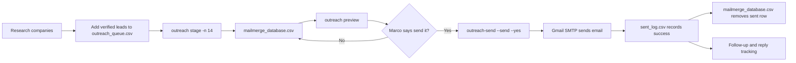
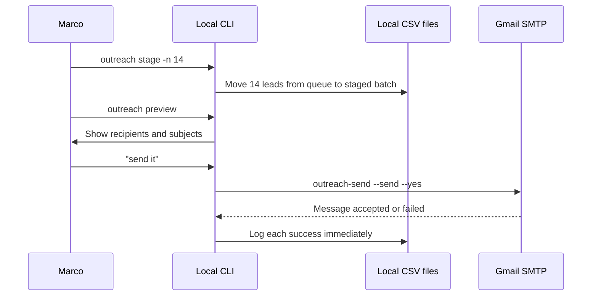
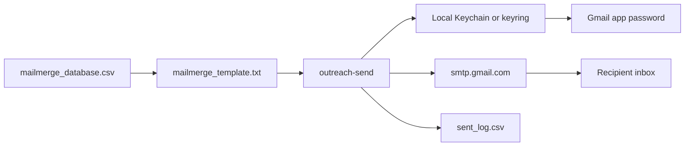
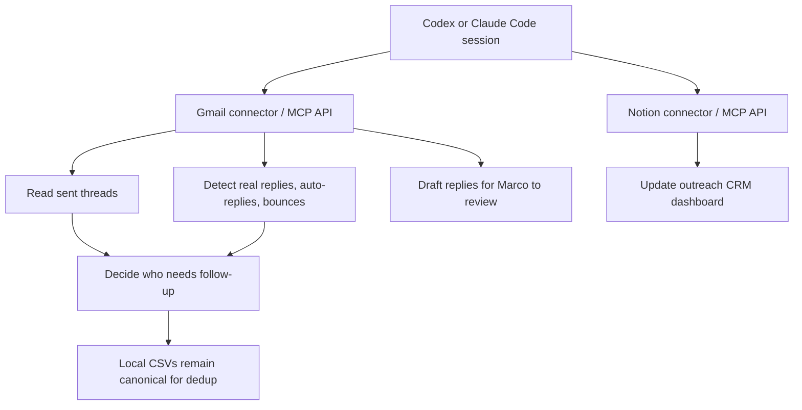
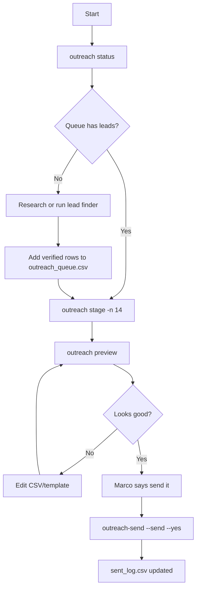
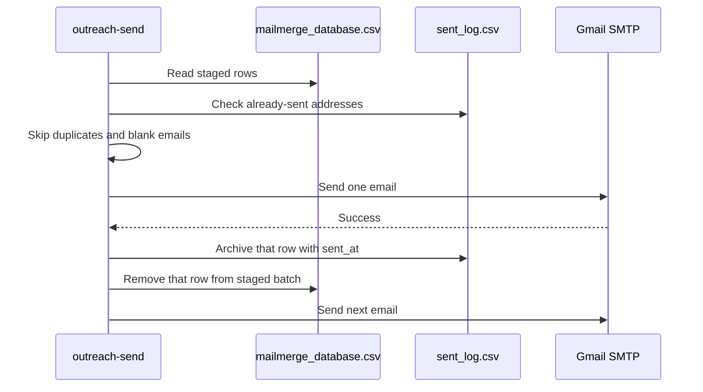
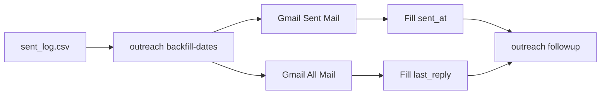

# Internship Cold-Email Kit

A small command-line toolkit that helps you run a careful internship outreach
pipeline from your own Gmail account.

It does four things:

1. Keeps a list of companies you have researched.
2. Turns each row into a personalized email using your template and resume.
3. Sends only after a human approval step.
4. Records every sent company so you do not email the same place twice.

There is no website and no hidden database. The system is just a few local CSV
files, a template, your resume, and Gmail.

## The Big Picture

Think of the pipeline like three trays on a desk:

```text
┌──────────────────────┐      ┌────────────────────────┐      ┌──────────────────┐
│ outreach_queue.csv   │      │ mailmerge_database.csv │      │ sent_log.csv     │
│                      │      │                        │      │                  │
│ Researched leads     │ ───▶ │ Today's staged batch   │ ───▶ │ Already emailed  │
│ Not emailed yet      │      │ Preview before sending │      │ Never email twice│
└──────────────────────┘      └────────────────────────┘      └──────────────────┘
        backlog                         outbox                         history
```

Each company should live in exactly one tray:

- `outreach_queue.csv`: researched, verified, not emailed yet.
- `mailmerge_database.csv`: staged for the next send.
- `sent_log.csv`: already emailed, with send and reply dates.

The important rule: sending moves a company into `sent_log.csv`, and future sends
check that log first.

## Visual Map



In plain English:

- You research companies and put only real, verified contacts in the queue.
- `stage` moves a small batch into the outgoing pile.
- `preview` shows what will be sent.
- The send command is the only door that can send email.
- Every successful send is logged immediately.

## What Each Piece Does

```text
Local files on your Mac
│
├── config.toml
│   └── Where your Gmail address, file paths, batch size, and target area live.
│
├── mailmerge_template.txt
│   └── The email body. Placeholders like {{company}} are filled from CSV rows.
│
├── Marco Resume.pdf
│   └── The attachment.
│
├── outreach_queue.csv
│   └── Leads waiting to be emailed.
│
├── mailmerge_database.csv
│   └── The current batch.
│
├── sent_log.csv
│   └── The permanent do-not-email-again record.
│
└── .backups/
    └── Automatic backups before CSV files are changed.
```

## The Two Commands That Matter

```text
outreach ...
    Safe command family.
    It checks status, stages rows, previews emails, and reads reply state.
    It never sends email.

outreach-send
    The only sender.
    Without --send, it only previews.
    With --send, it sends through Gmail after approval.
```

## Human Gate

The system is designed so an assistant can help prepare a batch, but cannot
silently blast emails.



The human approval phrase matters. The expected assistant workflow is:

```bash
outreach preview
# wait for Marco to say "send it"
outreach-send --send --yes
```

## Where Gmail, MCP, and APIs Fit

There are two different ways this project touches email.

### 1. Local sending path

This is the path that sends real email.



Important details:

- Sending uses Gmail SMTP.
- The Gmail app password is read from local Keychain, keyring, or an environment
  variable.
- The send must run on this Mac if the password is stored in this Mac's Keychain.
- The MCP/API connectors do not replace the sending command.

### 2. Assistant connector path

When an assistant session has Gmail, Notion, or other MCP/API connectors available,
those connectors are best used for reading and organizing context.



In plain English:

- Gmail MCP/API can look at threads and replies more intelligently than a simple
  local IMAP search.
- It can catch replies from a different address in the same thread.
- It can help tell a real human reply from an auto-reply.
- It can create Gmail drafts for Marco to review.
- It should not be treated as the final sending mechanism for cold batches.

## Pointer and Trigger Map

A "pointer" is a piece of information that tells the system what to act on next.
A "trigger" is the command or connector action that uses that pointer.

| Pointer | Trigger | What happens |
|---|---|---|
| Row in `outreach_queue.csv` | `outreach stage -n N` | Moves lead into the staged batch. |
| Row in `mailmerge_database.csv` | `outreach preview` | Renders the email for review. |
| `{{company}}`, `{{note}}`, etc. | Template rendering | Replaces placeholders with CSV values. |
| `ATTACHMENT:` in the template | `outreach-send` | Attaches the resume file. |
| Gmail app password service name | `outreach-send --send` | Logs into Gmail SMTP locally. |
| `contact_email` in `sent_log.csv` | Every send | Blocks duplicates. |
| Message-ID and email thread headers | `outreach backfill-dates` | Finds replies, including different-address replies. |
| Gmail thread from MCP/API | Assistant reply check | Reads the whole conversation and classifies the reply. |
| CRM row in Notion | Assistant CRM update | Updates status, next action, and follow-up date. |

The safest mental model:

```text
CSV files decide who is in the campaign.
The template decides what the email says.
Gmail SMTP sends only after approval.
sent_log.csv prevents duplicate outreach.
MCP/API connectors help read, classify, draft, and track.
```

## First-Time Setup

```bash
git clone https://github.com/Mianmalol/internship-cold-email-kit.git
cd internship-cold-email-kit
pip install .
```

Optional but useful:

```bash
pip install ".[keyring]"
pip install -e ".[dev]"
```

Create local config and template:

```bash
outreach setup
cp mailmerge_template.txt.example mailmerge_template.txt
```

Edit `config.toml`:

```toml
[email]
address = "you@gmail.com"

[files]
template = "mailmerge_template.txt"
database = "mailmerge_database.csv"
sent_log = "sent_log.csv"
queue = "outreach_queue.csv"
resume = "resume.pdf"

[pacing]
batch_size = 14
followup_after_days = 6

[outreach]
area = "Machine learning, software engineering, and physics simulation internships"
```

Store your Gmail app password once:

```bash
keyring set mailmerge-gmail "$USER"
```

Or on macOS Keychain:

```bash
security add-generic-password -s mailmerge-gmail -a "$USER" -w
```

Confirm setup:

```bash
outreach setup
```

## Daily Workflow



Commands:

```bash
outreach status
outreach stage -n 14
outreach preview
outreach-send --send --yes
```

Reply and follow-up check:

```bash
outreach backfill-dates --apply
outreach followup
```

## Command Reference

### Safe commands

These do not send email:

| Command | Meaning |
|---|---|
| `outreach status` | Shows how many leads are queued, staged, and sent. |
| `outreach setup` | Checks config, resume, sender, and password access. |
| `outreach find` | Prints a research brief and exclude list for lead finding. |
| `outreach stage -n 14` | Moves 14 leads from queue to staged batch. |
| `outreach preview` | Shows the staged emails. Sends nothing. |
| `outreach replies` | Reads Gmail over IMAP and reports replies/bounces. |
| `outreach backfill-dates --apply` | Writes send/reply dates into `sent_log.csv`. |
| `outreach followup` | Lists contacts due for a follow-up. |

### Sender commands

| Command | Meaning |
|---|---|
| `outreach-send` | Dry run. Shows what would send. |
| `outreach-send --send` | Preview, ask for terminal confirmation, then send. |
| `outreach-send --send --yes` | Send without terminal prompt after chat approval. |

## What Happens During a Send



If the first email succeeds and the second fails:

```text
sent_log.csv              mailmerge_database.csv
────────────              ──────────────────────
first email logged        failed email remains staged
```

That means rerunning is safe. The successful email will be skipped, and the failed
one can be retried.

## File Guide

| File | Simple meaning | Usually edited by |
|---|---|---|
| `config.toml` | Settings for this machine and campaign. | Human once |
| `mailmerge_template.txt` | The email body and headers. | Human |
| `outreach_queue.csv` | Not-yet-emailed leads. | Human or assistant |
| `mailmerge_database.csv` | The currently staged batch. | Tool |
| `sent_log.csv` | The do-not-email-again log. | Tool |
| `portal_targets_for_later.csv` | Companies that require web forms. | Human or assistant |
| `.backups/` | Recovery copies before CSV changes. | Tool |
| `AGENTS.md` / `CLAUDE.md` | Private local operating guide for assistants. | Human |

Private files are gitignored. Only examples and source code are meant to be
committed.

## CSV Columns

Each lead row uses these columns:

| Column | Example | Purpose |
|---|---|---|
| `contact_email` | `founders@example.com` | Where the email goes. |
| `contact_name` | `Alex` | Greeting name. |
| `company` | `Example Robotics` | Company name in the email. |
| `role` | `Simulation Intern` | Role label for tracking. |
| `subject` | `Physics simulation internship` | Email subject. |
| `note` | `Your robotics simulator is exactly the kind of system I want to help build` | Company-specific sentence. |

Template placeholders come from these column names:

```text
Hi {{contact_name}},

I'd love to help build {{company}}. {{note}}.
```

## Follow-Ups and Replies

The local reply checker uses Gmail IMAP:



Assistant MCP/API connectors can be more powerful:

```text
Local IMAP checker:
    Good for automatic dates and many replies.

Gmail MCP/API connector:
    Better for full-thread reading, different-address replies, auto-reply detection,
    and drafting a response for Marco to review.
```

The final follow-up rule is simple:

```text
If a company is in sent_log.csv,
and it has no last_reply,
and enough days have passed,
then outreach followup lists it.
```

## Safety Rules

- Do not guess emails.
- Do not send huge batches.
- Do not re-contact companies that declined.
- Keep `sent_log.csv` as the canonical duplicate blocker.
- Preview before sending.
- Use MCP/API connectors for reading, organizing, and drafting, not for silently
  sending cold batches.

## Privacy

The real campaign files stay on your machine:

```text
config.toml
mailmerge_template.txt
mailmerge_database.csv
outreach_queue.csv
sent_log.csv
portal_targets_for_later.csv
AGENTS.md
CLAUDE.md
*.pdf
.backups/
```

These are ignored by git because they can contain personal information, contacts,
strategy, or credentials.

## Troubleshooting

| Problem | What it usually means | Fix |
|---|---|---|
| `No targets... Nothing to send.` | The staged batch is empty. | Run `outreach stage -n 14`. |
| `Template not found` | Config points to the wrong template path. | Check `[files].template`. |
| `No Gmail app password found` | Password is not in keyring/Keychain/env. | Run the password setup command again. |
| A company appears twice | It was duplicated before staging. | `stage` and `send` dedup by email/company. |
| Replies look incomplete | Local IMAP can miss some edge cases. | Use Gmail MCP/API connector for thread review. |

## Developer Checks

```bash
pip install -e ".[dev]"
ruff check .
pytest -q
```

The runtime code itself is standard-library only. Dev tools are optional.

## License

MIT. See [LICENSE](LICENSE).
